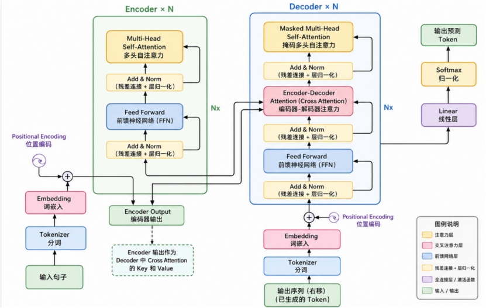

Transformer 基础 → Embedding（文本向量化）→ 向量数据库（Vector Database）→ RAG（检索增强生成） → LangGraph Agent（智能体）

1.Token、上下文窗口作用与限制
2.Embedding 向量作用（RAG 为什么要用向量数据库）
3.QKV 自注意力通俗解释
4.Encoder 和 Decoder 区别（BERT/GPT 差异）
5.参数模型 / 非参数模型区别


> Transformer 负责理解和生成文本；Embedding 将文本转换为向量；向量数据库负责相似度检索；RAG 为大模型提供外部知识；Agent 在此基础上实现任务规划、工具调用和自动执行。

---

# 1. Token 与上下文窗口
## 1.1 Token
**Token** 是模型处理文本的最小单位。

例如：

```text
输入：
I love AI

Tokenizer：
["I", "love", "AI"]
```

模型真正处理的是 Token ID，而不是原始文字。

---
## 1.2 Context Window（上下文窗口）
上下文窗口表示：

> **模型一次最多能够处理的 Token 数量。**

上下文包括：

- 用户输入
- 系统提示词
- 历史对话
- RAG 检索内容
- 已生成内容

例如：

```text
Context Window = 128K Token
```

表示一次最多处理约 128000 个 Token。

---

## 1.3 作用

上下文越大，模型能够：

- 阅读更长文档
- 保留更多聊天历史
- 理解完整代码
- 提高长文本处理能力

---

## 1.4 限制

上下文窗口不是无限的。

超过长度后：

- 前面的内容会被截断
- 模型无法继续利用这些信息

因此长文通常需要：

- 文本切分（Chunk）
- RAG 检索
- 摘要压缩

---

# 2. Embedding（向量表示）

## 2.1 什么是 Embedding

Embedding 的作用：

> **把文本转换成向量。**

例如：

```text
猫

↓

[0.21, -0.73, 0.56, ...]
```

向量能够表示文本的语义信息。

---

## 2.2 为什么需要 Embedding

计算机不能直接理解文字。

但可以计算向量之间的距离。

例如：

```text
苹果 —— 香蕉（距离近）

苹果 —— 汽车（距离远）
```

距离越近，语义越相似。

---

## 2.3 Transformer 中的位置

```text
文本
   │
Tokenizer
   │
Embedding
   │
Position Encoding
   │
Transformer
```

Embedding 是 Transformer 的输入层。

---

## 2.4 为什么 RAG 要使用向量数据库

流程如下：

```text
文档
   │
Embedding
   │
向量
   │
存入向量数据库
```

查询时：

```text
用户问题
      │
Embedding
      │
向量检索
      │
返回最相关文档
      │
LLM 生成答案
```

这样模型只读取相关知识，而不用遍历所有文档。

---

# 3. Self-Attention（Q、K、V）

Transformer 最核心的机制就是 **Self-Attention（自注意力）**。

每个 Token 都会生成三个向量：

| 向量 | 作用 |
|------|------|
| Query（Q） | 我要找什么 |
| Key（K） | 我有什么信息 |
| Value（V） | 我的具体内容 |

计算过程：

```text
Q 与所有 K 计算相似度

↓

得到注意力权重

↓

对所有 V 加权求和

↓

得到新的 Token 表示
```

作用：

> 每个词都可以关注整个句子中最重要的信息。

例如：

```text
The animal didn't cross the street because it was tired.
```

模型能够知道：

```
it → animal
```

而不是：

```
it → street
```

---

# 4. Encoder 与 Decoder

Transformer 由 **Encoder** 和 **Decoder** 两部分组成。

## Encoder

作用：

> 理解输入文本。

特点：

- 双向阅读
- Self-Attention
- 输出文本特征

典型模型：

- BERT

适合：

- 分类
- 检索
- 情感分析
- 文本表示

---

## Decoder

作用：

> 根据已有内容生成下一个 Token。

特点：

- Masked Self-Attention
- 只能看到历史内容
- 自回归生成

典型模型：

- GPT

适合：

- 对话
- 写作
- 翻译
- 代码生成

---

## BERT 与 GPT 对比

| 对比项 | BERT | GPT |
|---------|------|------|
| 结构 | Encoder | Decoder |
| 阅读方式 | 双向 | 单向 |
| 主要能力 | 理解 | 生成 |
| 应用 | 分类、检索 | 对话、生成 |

---

# 5. 参数模型 与 非参数模型

## 参数模型（Parametric Model）

知识保存在模型参数中。

例如：

- GPT
- Llama
- Qwen

特点：

✅ 推理速度快

❌ 知识固定

❌ 更新需要重新训练

---

## 非参数模型（Non-Parametric Model）

知识存放在外部知识库。

例如：

- 文档
- 数据库
- 向量数据库

查询流程：

```text
用户问题

↓

向量检索

↓

找到相关文档

↓

LLM 阅读并回答
```

特点：

✅ 易更新

✅ 支持最新知识

✅ 降低模型幻觉

---

## 对比

| 对比项 | 参数模型 | 非参数模型 |
|---------|----------|------------|
| 知识位置 | 模型参数 | 外部知识库 |
| 更新方式 | 重新训练 | 更新数据库 |
| 实时知识 | 较弱 | 强 |
| 是否依赖检索 | 否 | 是 |

---

# 总结

```text
Transformer
    │
    ├── Token：文本切分
    ├── Embedding：文本向量化
    ├── Self-Attention：理解上下文关系
    ├── Encoder：理解文本（BERT）
    └── Decoder：生成文本（GPT）
            │
            ▼
Embedding 向量
            │
            ▼
向量数据库
            │
            ▼
RAG（检索增强生成）
            │
            ▼
LangGraph Agent（智能体）
```

> **一句话总结：** Transformer 提供语言理解与生成能力，Embedding 提供语义表示，向量数据库负责知识检索，RAG 将检索结果交给大模型，LangGraph Agent 则将大模型与工具结合，实现复杂任务的自动执行。